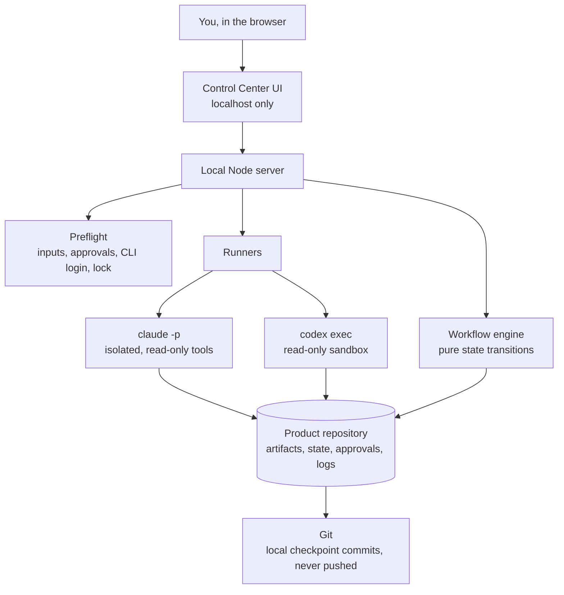
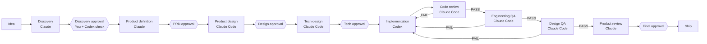
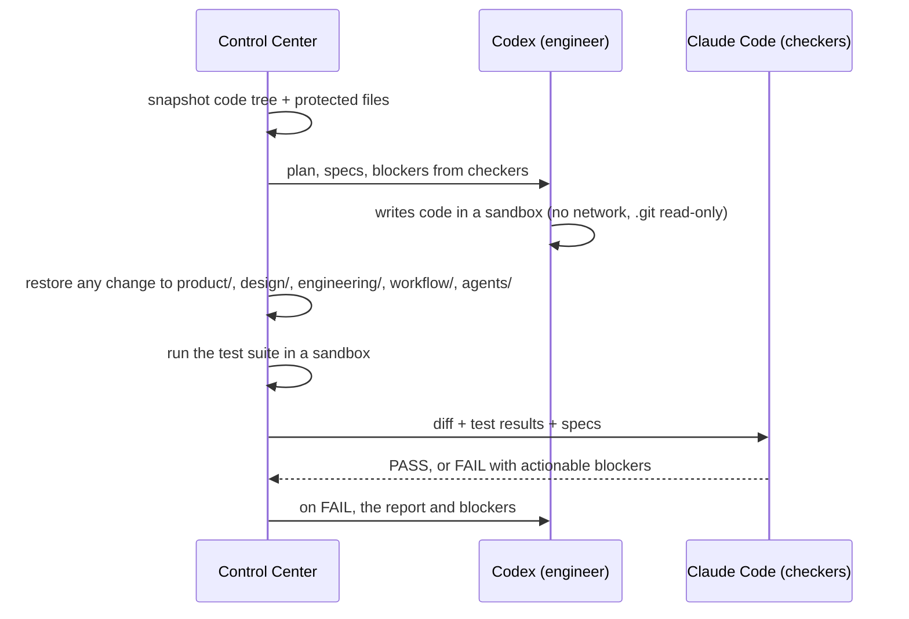

# AI SDLC Control Center

A local control center for a multi-agent product development workflow, from a raw idea to a shipped product. Specialized AI agents collaborate through versioned artifacts, explicit handoffs, quality gates and mandatory human approvals.

The Control Center is the **control layer**. The AI CLIs you already pay for (Claude Code and Codex) are the **execution layer**. The product's Git repository is the **source of truth**.

> **Status: v0.4, end to end.** The whole workflow runs with real models, from the idea to a tagged release: *Idea → Discovery → PRD → Design → Tech design* (Claude writes, Codex cross-checks, a human approves each), then *Implementation (Codex) → Code review → Engineering QA → Design QA* (Claude Code checks, any FAIL goes back to the engineer), then *Product review (Claude) → final human approval → Ship*. See [Roadmap](#roadmap).

---

## Why this exists

Most "AI team" demos are a chain of prompts that share one chat context. That breaks in three ways: you can't audit what each step saw, one model grades its own work, and nothing stops the chain from running past a bad decision.

This project takes the opposite position:

- **Agents share nothing but files.** Every agent starts with no memory. It only knows what is in the input artifacts, and the next agent only knows what it wrote.
- **The model that builds an artifact never grades it.** Checks run on a different vendor.
- **Humans own the strategic gates.** The workflow physically cannot pass a gate without an approval recorded in the repository.
- **Constraints are enforced by mechanism, not by prompt.** A reviewer "must not modify code" because it runs in a read-only sandbox, not because the prompt asks nicely.

## Architecture



| Layer | What it is | Where |
|---|---|---|
| UI | Single page, vanilla JS, polls the server | `web/` |
| Server | Node built-in HTTP server, binds to 127.0.0.1 | `server/index.ts` |
| Engine | Pure functions: every rule about what may happen next | `server/engine.ts` |
| Runners | Prompt assembly, CLI invocation, deterministic checks, handoff | `server/runner.ts`, `server/clis.ts` |
| Persistence | Plain JSON and Markdown files in the product repo | `server/store.ts` |
| Definitions | Workflow graph, agent contracts, JSON schemas | `templates/` |

There is no database, no cloud backend, no agent framework and no build step. Three runtime dependencies: `marked` (render Markdown), `yaml` (read contract headers) and `playwright` (screenshots for Design QA).

### Tool vs. product

The Control Center code and each product live in **separate Git repositories**. A product workspace is created under `workspaces/<slug>/` (ignored by this repo) with its own `git init`. This keeps a future coding agent from ever reaching the Control Center's own code, and makes each product portable.

## The workflow



Statuses: `WAITING`, `READY`, `RUNNING`, `PASS`, `FAIL`, `BLOCKED`, `APPROVAL_REQUIRED`, `APPROVED`, `REJECTED`.

### Agents and why each model has its role

| Agent | Model | Checked by | Rationale |
|---|---|---|---|
| Product Researcher | Claude | Codex (advisory) + you | Strong web research and synthesis; a different vendor looks for unsupported claims |
| Product Manager | Claude | Codex (advisory) + you | Structured writing that follows constraints |
| Product Designer | Claude Code | Codex (advisory) + you | Produces a design spec, a design system and a self-contained HTML prototype as the visual reference |
| Tech Lead | Claude Code | Codex (advisory) + you | Reads the repository and designs the approach |
| Software Engineer | **Codex** | Claude Code, three times | The only agent with write access to production code |
| Code Reviewer | Claude Code | routes the workflow | Different vendor from the engineer |
| Engineering QA | Claude Code | routes the workflow | Different vendor, so it does not share the engineer's blind spots about which cases to test |
| Design QA | Claude Code | routes the workflow | Compares the running app against the approved prototype |
| Product Reviewer | Claude | you, at the final gate | Did we build the right product? |

**Cross-checks on product stages are advisory; on engineering stages they route the workflow.** "Does it work" is verifiable, so an engineering FAIL sends work back to the engineer automatically. Whether a discovery is good enough is judgment, and judgment belongs to the human. Each gate stores both the critic's verdict and the human decision, which makes it possible to measure judge-versus-human agreement before ever letting a judge block anything.

Gemini was part of the original design. Since June 2026 the Gemini CLI no longer serves personal Google accounts, and Figma's write-to-canvas is not usable on the free plan, so V1 runs on Claude Code and Codex only. The workflow definition maps agents to CLIs in one place (`templates/workflow.json`), so adding a vendor back is a configuration change plus an adapter.

## Protocols

### Agent contracts (`agents/*.md`)

Markdown with a YAML header, the same shape as Claude Code subagents. The header is machine-readable; the body is the agent's instructions.

```yaml
---
id: product-researcher
role: Product Researcher
tool: Claude
cli: claude
inputs: [product/idea.md]
outputs: [product/discovery.md]
output_schema: producer
required_sections: [Summary, Problem, Target users, Facts, Hypotheses, ...]
next_on_pass: discovery-approval
return_on_fail: product-researcher
---
```

### Agent responses (`workflow/schemas/*.schema.json`)

Agents do not write files. Each agent's **final response is forced into a JSON Schema** by the CLI itself (`claude --json-schema`, `codex exec --output-schema`). Producers return `status`, `summary`, `artifacts` (a list of `{path, content}`) and `blockers`. The Control Center writes each artifact only if its path is one of the stage's declared outputs. This is how "an agent only writes its own output" is enforced. The tools an agent may use come from its contract, and the runner refuses any producer contract that asks for a write-capable tool.

### Handoff record (`workflow/runs/<runId>/handoff.json`)

Written by the Control Center after every run. A future orchestrator only needs this file to route.

```json
{
  "protocol": "aisdlc.handoff/v1",
  "runId": "20261007-150701-discovery",
  "stage": "discovery",
  "agent": "product-researcher",
  "cli": "claude",
  "status": "PASS",
  "summary": "I checked Sponte, iScholar and F10 against their official websites...",
  "outputs": ["product/discovery.md"],
  "blockers": [],
  "checks": [{ "name": "Section \"Facts\"", "ok": true, "detail": "" }],
  "next": "discovery-approval",
  "returnTo": null,
  "startedAt": "...",
  "completedAt": "..."
}
```

`checks` are deterministic and run by the Control Center: every declared output is present and non-empty, no undeclared file is returned, every required section of every Markdown file is present and non-empty, and HTML outputs are HTML documents. An agent saying PASS is not enough: if a check fails, the stage fails and its files are kept only as drafts inside the run folder.

### Product repository layout

```
workspaces/<product>/
├── agents/                 contracts used for this product (snapshot, auditable)
├── product/                idea.md, discovery.md, prd.md, product-review.md
├── design/                 design-spec.md, design-system.md, prototype/, design-qa.md
├── engineering/            tech-spec.md, implementation-plan.md, code-review.md, qa-report.md
└── workflow/
    ├── workflow.json       stage graph, owners, inputs, outputs, routing
    ├── state.json          current state (the UI is only a view of this)
    ├── activity.jsonl      append-only activity log
    ├── approvals/<gate>.json   every human decision, with timestamp and feedback
    ├── checks/<gate>.md    independent cross-vendor checks
    ├── schemas/            response and handoff schemas
    └── runs/<runId>/       prompt.md, events.jsonl, stdout.jsonl, handoff.json
```

Everything is readable without the UI. Restarting the server loses nothing.

## Human gates

- Gates sit after Discovery, PRD, Design, Tech design and Product review.
- **Approve** unlocks the next stage and creates a local checkpoint commit. Nothing is pushed. The approval record stores a SHA-256 of every approved file, which pins the exact version (for example, the exact prototype) the human signed off on.
- **Reject** requires feedback. The author stage goes back to `READY`, and the next run's prompt includes the feedback and the rejected version.
- The engine refuses decisions while any agent is running and refuses approval of anything not `APPROVAL_REQUIRED`. The HTTP API goes through the same engine, so the rules cannot be bypassed from outside the UI.
- **Run Codex check** is optional and never blocks the gate.

## The engineering loop

The Software Engineer (Codex) is the only agent that can change production code, and it is checked three times by a different vendor.



- **Writes are sandboxed.** Codex runs with `--sandbox workspace-write`: it can write only inside the product folder, has no network and cannot touch `.git`, so it cannot commit or rewrite history.
- **Other roles' files are protected by snapshot.** Before the run the Control Center copies `agents/`, `product/`, `design/`, `engineering/` and `workflow/`. Afterwards it restores anything the engineer changed, created or deleted there, and the run fails with the list of reverted files.
- **Tests are run by the Control Center, not trusted from the agent.** After every engineer run, and before every check, the product's `npm test` script runs inside `codex sandbox` (writes limited to the product folder and temp, no network). Agent-written code never runs unsandboxed on your machine. An engineer cannot pass with a failing suite, and neither can a checker.
- **Checkers cannot change code.** Code review, Engineering QA and Design QA run on Claude Code with read-only tools only. They receive the diff and the test output from the Control Center.
- **Re-reviews see only the fix.** Code is snapshotted as Git tree objects (no commits). The first code review sees the whole implementation; after a fix, it sees only the change since its last review, plus its previous report, and checks that each blocker was resolved. Engineering QA and Design QA always see the whole implementation.
- **Fixes always go back through review.** QA FAIL → engineer → code review (fix only) → QA. Design QA FAIL → engineer → code review → QA → Design QA.
- **A broken checker does not bounce work.** If a checker crashes, returns a malformed report, or says FAIL without actionable blockers, the checker stage fails in place and the engineer is not called.
- **Loops are bounded.** Three consecutive FAIL verdicts from the same checker block it until a human steps in.
- **Design QA compares pixels.** The engineer declares the URL path of every screen in the design's inventory. The Control Center serves the prototype and the app (static files directly, or `npm start` in the sandbox), takes screenshots with headless Chromium (prototype and app on mobile, app on desktop, up to 8 screens), and gives them to Claude Code, which opens each image. The page may only reach `localhost`; every other request is blocked. Screenshots appear as thumbnails in the stage detail.
- **Packages are installed by a human, not by the agent.** The engineer never has network access. When it needs a package it declares it in `package.json` and stops; the Control Center lists it and a human clicks **Install**. The install uses only the public npm registry, with lifecycle scripts disabled (`--ignore-scripts`), and refuses git, file or URL specs and any `.npmrc` in the product. A successful install resets the engineer's failure streak, since the environment changed.

## Closing the loop

- **Product review** reads the whole trail (discovery, PRD, design, specs and every review) and answers one question: did we build the right product? Its report is kept even when it blocks.
- **When it blocks, the human chooses where the work goes back.** Any earlier agent stage can be reopened with a reason, and that reason reaches the agent's next prompt. Choosing the stage is a product decision, so it is not automated.
- **Final approval** creates a checkpoint commit and an annotated Git tag `ready-to-ship-<timestamp>` in the product repository, and the Ship stage is marked done. Nothing is pushed or deployed.

## Execution safety

| Rule | How it is enforced |
|---|---|
| No paid API usage | Preflight requires a subscription login (`claude auth status` → `claude.ai`; `codex login status` → ChatGPT). `ANTHROPIC_API_KEY`, `OPENAI_API_KEY` and similar are stripped from the agent's environment. |
| No auto-approved permissions | Claude runs with `--permission-mode dontAsk` and an explicit tool allowlist: anything else is denied, not approved. Codex reviewers run with `--sandbox read-only`. No `bypass` or `dangerously` flags are used (a unit test asserts this). |
| Agents isolated from your personal setup | Claude runs with `--setting-sources project`, `--strict-mcp-config`, `--disable-slash-commands` and excludes every ancestor `CLAUDE.md`. Codex runs with `--ignore-user-config` and `--ephemeral`. |
| One agent at a time | A single active-run lock in `state.json`, checked by the engine. Only the engineer has write access. |
| Agent-written code | Codex writes inside a seatbelt sandbox; tests run inside `codex sandbox`; protected files are restored after every engineer run. |
| Agents cannot write outside their artifact | Producers have read-only tools; the Control Center writes the artifact from the schema-validated response. |
| Local only | Server binds to `127.0.0.1`, rejects foreign `Host` headers (DNS rebinding) and cross-origin or non-JSON writes (CSRF). |
| Untrusted agent output | Rendered Markdown escapes raw HTML and only links `http(s)` and relative URLs. The HTML prototype opens in a sandboxed iframe with an opaque origin, so its scripts cannot call the Control Center API. |
| Stuck runs | 20-minute timeout per run; Stop button; runs interrupted by a restart are closed as `FAIL`. |
| Endless retries | Three consecutive failures mark a stage `BLOCKED` until a human unblocks it. |

## Getting started

### Requirements

- macOS or Linux, Node.js **23.6 or newer** (runs TypeScript directly, no build step)
- Git
- [Claude Code](https://docs.claude.com/en/docs/claude-code) signed in with a Claude subscription: run `claude` once and log in
- [Codex CLI](https://github.com/openai/codex) signed in with ChatGPT: `codex login`
- For visual Design QA, a headless Chromium for Playwright (about 200 MB, stored in the Playwright cache, not in the project): `npx playwright install --only-shell chromium`. Without it, Design QA falls back to reading the code.

### Run

```bash
npm install
npm start
```

Open http://localhost:4317. Start the server from a normal terminal, not from inside a Claude Code session (nested Claude sessions are refused by the CLI).

### Use

1. **Create a product.** Name, idea, optional context. This writes `product/idea.md`, initializes the workflow state and makes the first commit.
2. **Run the current agent.** Select the stage. The preflight checklist shows inputs, approvals, CLI installation and login. The run button is disabled until everything passes. Progress streams live (web searches, files read).
3. **Inspect the artifact.** Click any file to open it with its metadata.
4. **Optionally run the independent check** at the gate.
5. **Approve or reject.**

### Upgrading an existing product

When a new version of the Control Center enables more stages, bring an existing product up to date:

```bash
npm run upgrade-workspace
```

It copies the current contracts, schemas and workflow definition into the product, makes the current stage runnable if it was waiting for a disabled stage, logs the upgrade and commits it. Old versions stay in the product's Git history.

### Tests

```bash
npm test
```

50 tests: engine rules (gates, rejection, routing, failure limits, restarts), CLI adapter flags (isolation and no auto-approval) and end-to-end HTTP scenarios using fake CLIs (`scripts/fake-cli.mjs`), so the suite never spends subscription quota.

## Known limitations

- **One product at a time.** The data layout already supports more.
- **Server apps get network during screenshots.** The Codex sandbox has no localhost-only mode, so an app that needs `npm start` runs with network enabled for the capture (at most 2 minutes, writes still confined, only after code review and QA passed). The browser itself blocks every non-local request. Static apps are served by the Control Center and run no agent code server-side.
- **Design QA sees each screen's default state.** Loading and error states that need a specific action are checked from the code, and listed for a human when they cannot be confirmed.
- **QA reasons from code and test results.** QA cannot execute its own experiments in v0.3; it judges the suite and reads the code adversarially.
- **One engineer run implements the whole plan.** Large plans can take a long time; per-task runs are planned.
- **Long single-shot outputs.** The designer writes three files, including a full HTML prototype, in one structured response; this takes several minutes with no intermediate progress in the live log.
- **Subscription quotas.** No per-token cost, but every run uses your Claude or ChatGPT plan allowance. Claude owns most roles, so its quota is consumed fastest.
- **Web research depends on Claude's web tools** being available on your plan.
- **Polling, not push.** The UI polls every 1.5 to 4 seconds.
- **The run log keeps the raw CLI output** (`stdout.jsonl`), which includes fetched web content. It is committed with the product repository.
- **The activity log line for a checkpoint commit lands after the commit**, so it shows as one changed file until the next commit.

## Troubleshooting

| Symptom | Fix |
|---|---|
| "Claude Code CLI signed in" fails | Run `claude` in a terminal and log in with your Claude account. |
| "Runs on your subscription" fails for Claude | You are logged in with an API key. Run `claude auth logout`, then log in with your Claude account. |
| "Codex CLI signed in" fails | Run `codex login` and choose ChatGPT. |
| A run fails with "nested session" | Start `npm start` from a regular terminal, not inside Claude Code. |
| A stage is `BLOCKED` | It failed three times in a row. Read the blockers, fix the input or the contract, then click **Unblock**. |
| A run shows "Control Center restarted" | The server stopped mid-run. Run the stage again. |

## Roadmap

- **v0.2 (done):** Product definition, Product design (design spec, design system and HTML prototype) and Tech design, each with its gate and Codex check.
- **v0.3 (done):** Implementation (Codex, sandboxed write access), Code review, Engineering QA and Design QA loops with automatic return to the engineer.
- **v0.4 (done):** Product review, reopen with a reason, final gate, release tag.
- **Packages (done):** dependency installs confirmed by a human.
- **Visual Design QA (done):** screenshots of the prototype and the running app.
- **V2:** automatic routing from the handoff record (PASS → `next`, FAIL → `returnTo`), multiple products, alternative models per role, judge-versus-human agreement metrics, cost and quota tracking, Figma as the visual source of truth on a paid seat.

## Author

Built by [Maria Eduarda Martins](https://mariaeduardamartins.com), AI Product Manager. Released under the [MIT License](LICENSE).
